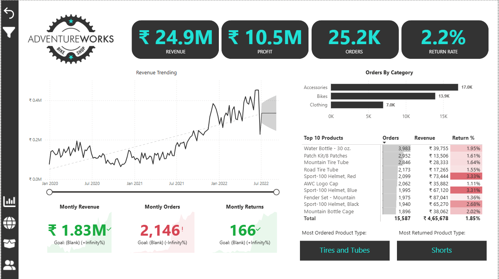
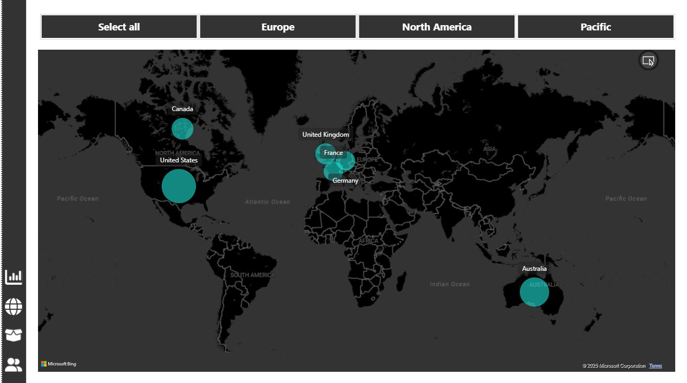

# AdventureWorks Business Intelligence Dashboard

## 🚀 Project Overview

This repository contains a **Business Intelligence solution** developed for **AdventureWorks**, a global manufacturing company, to provide key insights into their sales performance, customer base, and product trends.

The project was executed using **Microsoft Power BI Desktop** to transform raw transaction data into a robust relational model, enabling management to track critical KPIs and make data-driven decisions.

### The Business Challenge

The management team at AdventureWorks required a dynamic, interactive tool to track core Key Performance Indicators (KPIs) such as **Sales, Revenue, Profit, and Returns**. Specific business needs included:

  * Comparing **regional performance** across sales territories.
  * Analyzing **product-level trends** to optimize inventory and marketing.
  * Identifying **high-value customers** for targeted engagement.

-----

## 📂 Dataset
<a href="Adventure Works Raw Data/AdventureWorks Raw Data"> AdventureWorks DataSet</a>

-----

## 📊 Key Features & Analysis

The resulting Power BI dashboard is highly interactive and addresses all core business requirements through dedicated reports:

| Feature Area | Description | Deliverable |
| :--- | :--- | :--- |
| **Executive KPI Summary** | At-a-glance view of overall performance, including Total Sales, Revenue, Profit, and Returns, with year-over-year (YoY) and quarter-to-date (QTD) comparisons. | Primary Dashboard Screen |
| **Geographic Analysis** | Visualization of sales distribution across different **Sales Territories** and regions, allowing for quick regional performance comparison. | **Map** Visualization |
| **Product Deep Dive** | Detailed breakdown of sales and profit by **Product Category** and **Subcategory**, helping identify best and worst performers. | **Product Details** Report |
| **Customer Segmentation** | Identification of the top N customers based on sales value to pinpoint high-value individuals and assess their geographic distribution. | **Customer Details** Report |
| **Data Quality & Transformation** | Successfully connected to and cleaned multiple raw CSV files (transactions, returns, products, customers, territories) using Power Query. | ETL/Data Prep Process |

-----

## 💻 Technologies & Techniques

### Tools Used

  * **Microsoft Power BI Desktop:** Used for end-to-end development, including data transformation, modeling, DAX calculations, and visualization.

### Technical Implementation

| Component | Description |
| :--- | :--- |
| **Data Connection & Transformation** | **Power Query (M Language)** was used to connect to multiple raw **CSV files**, perform necessary data cleaning (e.g., handling missing values, standardizing formats), and structure the data. |
| **Data Modeling** | A **Star Schema** relational model was built, linking a central **Fact Table** (transactions) to various **Dimension Tables** (Product, Customer, Territory, Date). |
| **Calculated Measures** | Extensive use of **Data Analysis Expressions (DAX)** to create complex calculated measures for accurate KPI reporting, including: Total Sales, Profit Margins, Total Returns, and Time-Intelligence functions (YoY, QTD). |
| **Interactive Visualization** | Designed an intuitive and visually appealing dashboard with slicers, drill-through capabilities, and interactive charts to enhance user experience. |

-----

## 🖼️ Dashboard Screenshots

| Dashboard Component | Description |
| :--- | :--- |
| **Executive Dashboard** | High-level KPI summary and overall performance metrics. | 
| **Customer Details** | Breakdown of sales and profit by individual customers. |
| **Product Details** | Performance analysis across product categories and subcategories. |
| **Sales Territory Map** | Geographic visualization of sales performance. |

 
 
 
 

-----

## 🧑‍💻 Author

| Name | Role | Contact |
| :--- | :--- | :--- |
| **SaiKarthik** | Business Intelligence Analyst | www.linkedin.com/in/saikarthik26 |
| | | saikarthik2601@gmail.com |

-----
